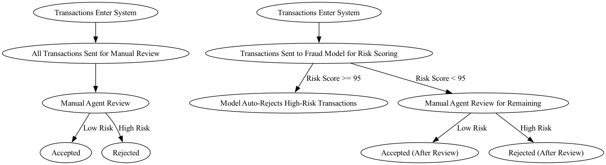
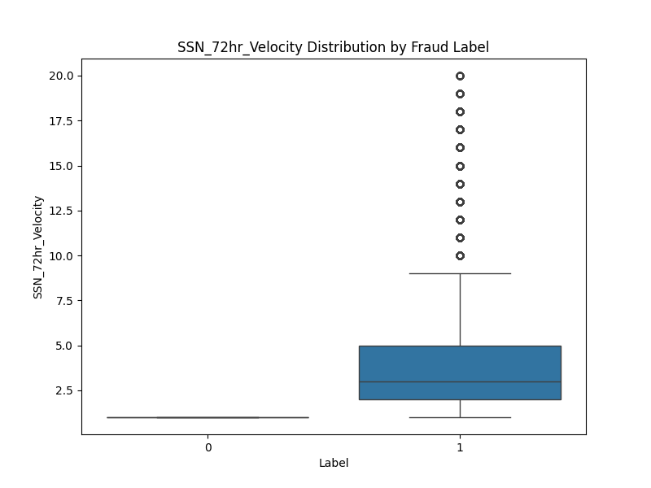
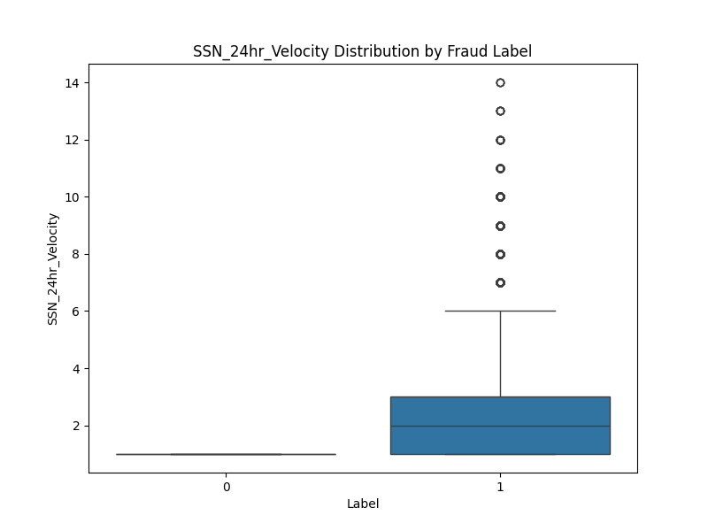
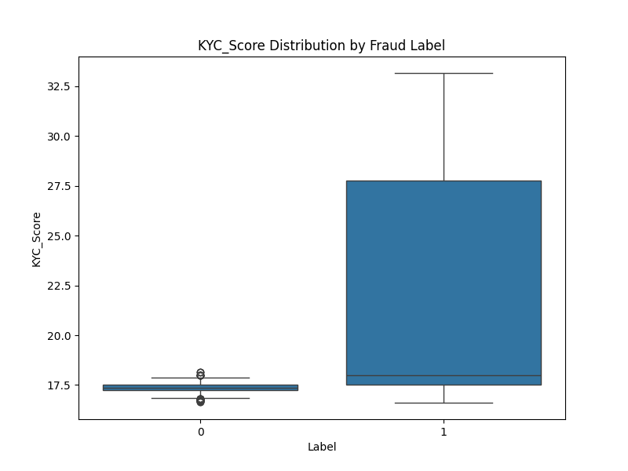
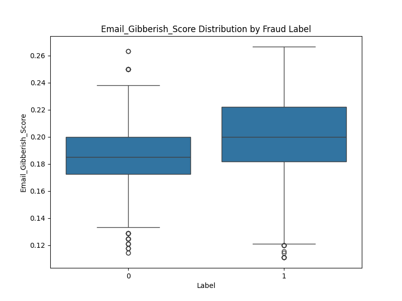

# Snowflake-Integrated Fraud Detection System

## Project Overview

In the digital financial landscape, fraudulent transaction attempts are becoming increasingly sophisticated. This project presents a comprehensive fraud detection pipeline that leverages synthetically generated data, behavioral features, and machine learning modeling—all integrated with Snowflake for scalable data operations. The aim is to proactively flag high-risk activity and reduce manual agent workload using a hybrid decision-making system.

## Dataset

The dataset used in this project was synthetically generated to simulate both benign and fraudulent account creation attempts. Fraudulent entities were designed to mimic real-world behavior, such as cycling through various emails, addresses, and phone numbers while keeping identifiers like SSN and DOB constant. 

### Preprocessing Steps
1. **Synthetic Data Generation:**
   - Simulated both fraudsters and legitimate users with realistic patterns.
   - Generated velocity-based features (e.g., SSN usage within 24/72 hours).

2. **Feature Engineering:**
   - Computed key behavioral features:
     - `SSN_24hr_Velocity`
     - `SSN_72hr_Velocity`
     - `Phone_24hr_Velocity`
     - `Phone_72hr_Velocity`
     - `KYC_Score` (based on email, phone, and address risk)
     - `Email_Gibberish_Score`


3. **Label Encoding:**
   - 0 = Benign, 1 = Fraudulent.

4. **Model Training:**
   - Applied SMOTE for class balancing.
   - Trained XGBoost model on feature set.
   - Integrated output with a risk-scoring mechanism.

## Methodology

### Fraud Detection Workflow
The model enhances the legacy all-manual review pipeline by introducing a hybrid model-agent system:

- Transactions with a model risk score **≥ 95** are **auto-rejected**.
- Transactions **< 95** are routed to **manual review**.
- This process reduces operational load while improving response time.
  




### Model Training
- **Model Used:** XGBoost Classifier
- **Sampling:** SMOTE to balance classes
- **Risk Threshold:** Score ≥ 95 for auto-rejection
- **Integration:** Model outputs written into Snowflake table for further consumption

### Feature Analysis
Key features were evaluated based on their distribution across labels (benign vs. fraudulent).

#### SSN Velocity Distributions



#### Risk and Anomaly Features



## Results

### Workflow Efficiency
The introduction of the model reduced manual agent review volume by approximately **35%** by auto-rejecting extreme-risk transactions, with no compromise to fraud catch rate.

### Feature Importance
- SSN and phone velocity features showed clear separation between fraud and benign.
- `KYC_Score` and `Email_Gibberish_Score` provided strong signal for risk modeling.

### Model Performance
- Model Accuracy: **Above 90%**
- High-risk flagging precision: **Very high (≥ 95 risk score threshold)**
- Integration-ready with Snowflake for production usage

## Usage

### Prerequisites
- Python 3.x
- Snowflake Python Connector
- Required packages listed in `requirements.txt`

### Installation
1. Clone the repository:
   ```bash
   git clone https://github.com/imArjunMalik/snowflake-fraud-detection.git
   cd snowflake-fraud-detection

